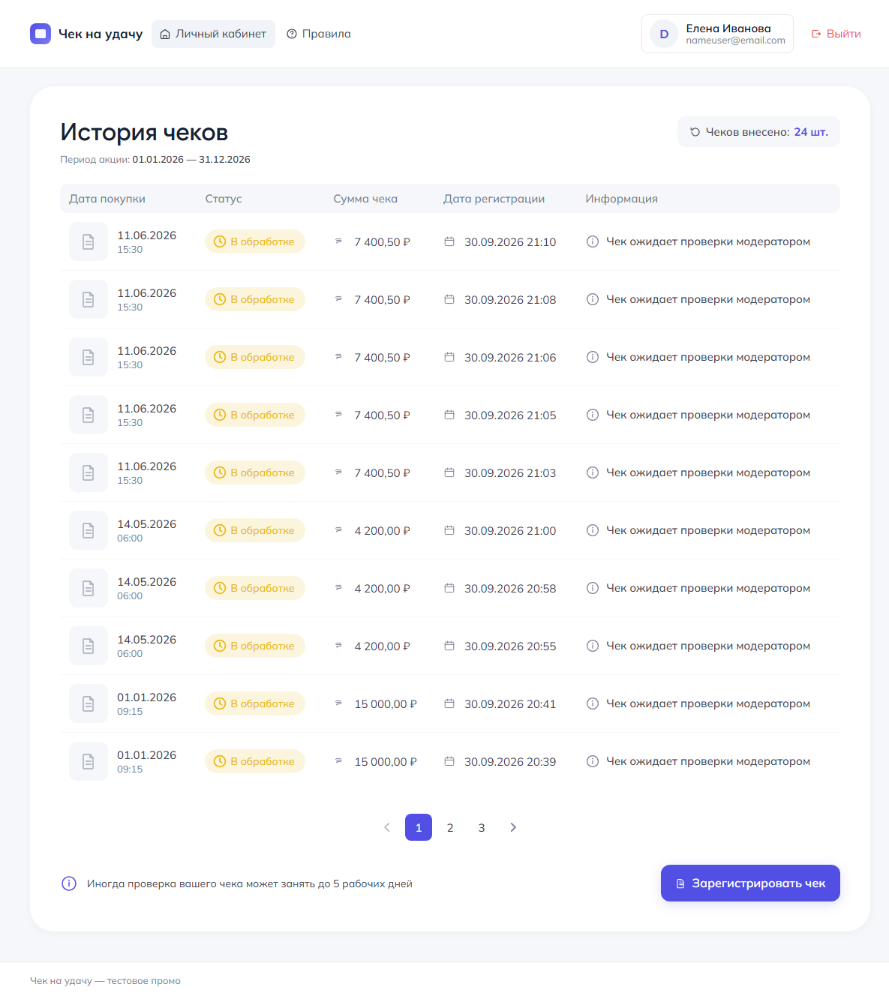
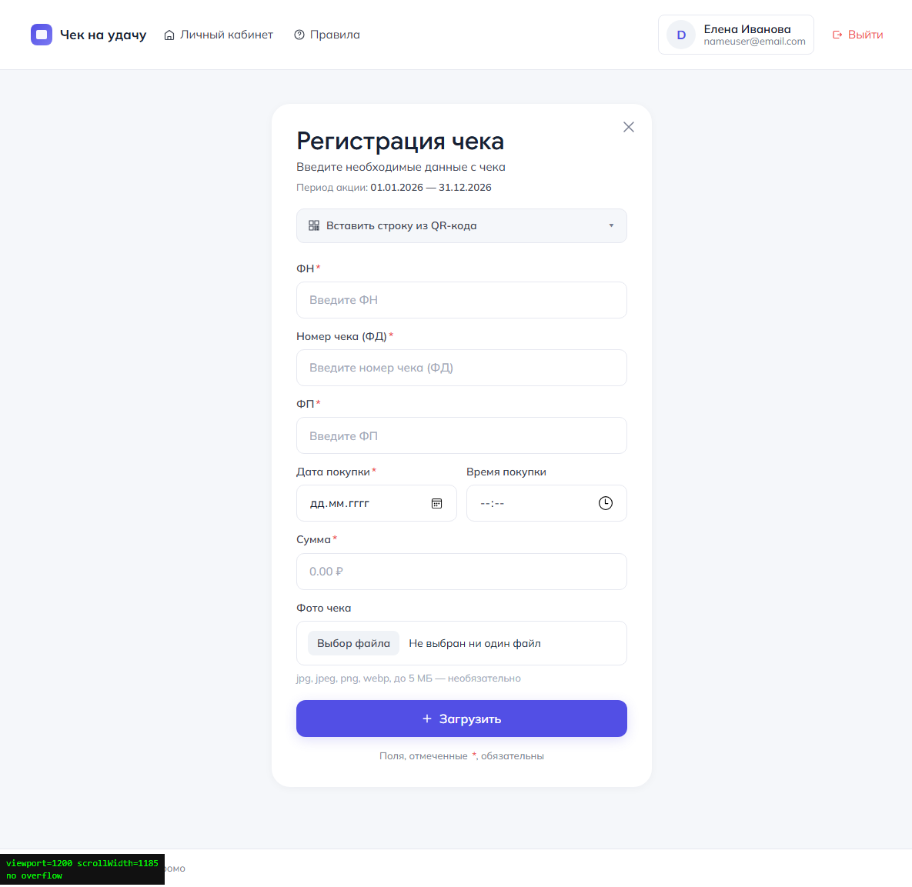
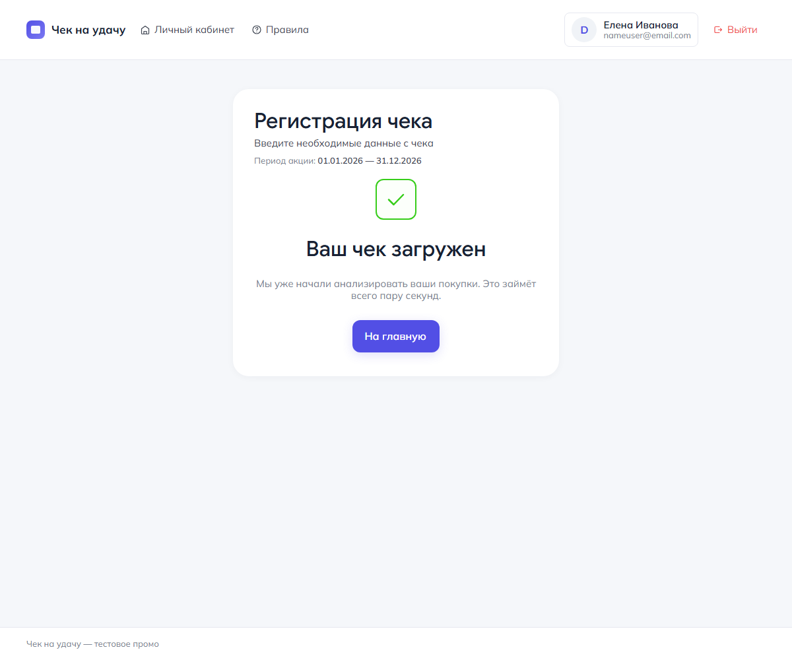
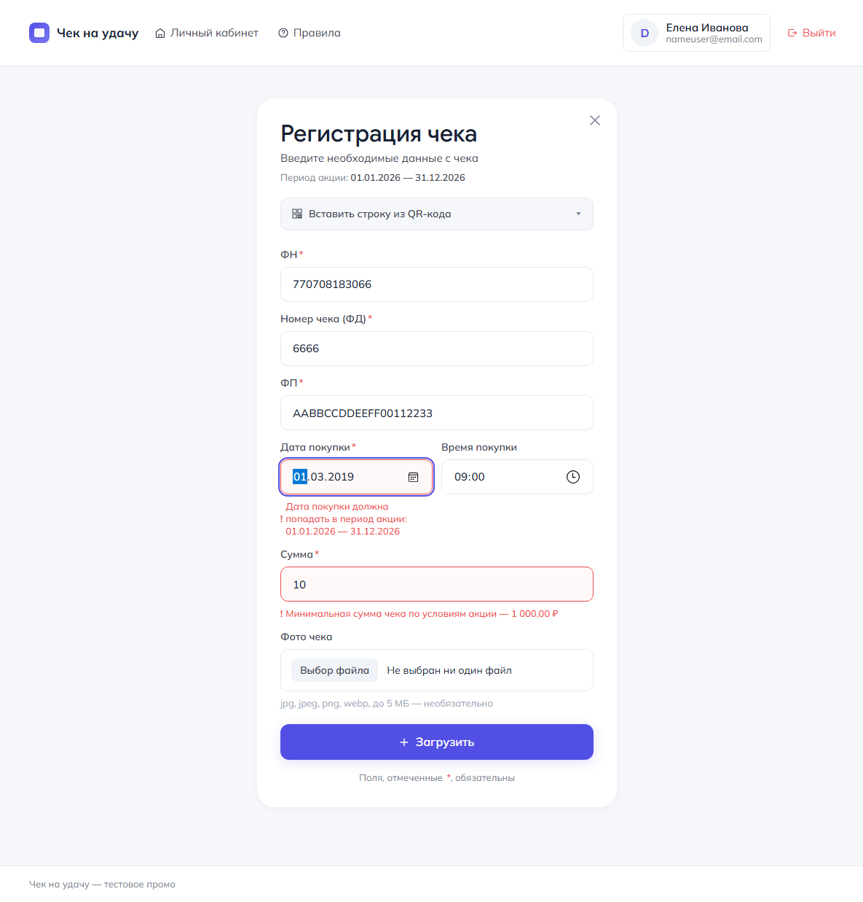
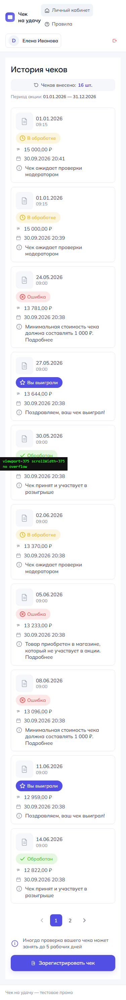

# Чек на удачу

Промо-акция «Чек на удачу»: покупатель загружает кассовый чек, модератор его
проверяет. Небольшое веб-приложение на Django + PostgreSQL, фронтенд —
шаблоны Django и чистый JS.

Стек: **Python, Django, PostgreSQL, Docker**. Фреймворк на фронте не
используется — достаточно чистого JS.

| Личный кабинет | Регистрация чека |
|---|---|
|  |  |

| Экран успеха | Ошибки валидации | 375 px |
|---|---|---|
|  |  |  |

---

## Быстрый старт

```bash
cp .env.example .env          # Windows: copy .env.example .env
# при необходимости поменяйте DJANGO_SECRET_KEY и DJANGO_ALLOWED_HOSTS
docker compose up             # или docker compose up --build
```

Сайт: <http://localhost:8000/> · Админка: <http://localhost:8000/admin/>

`docker compose up` поднимает PostgreSQL, дожидается его готовности,
накатывает миграции, собирает статику и запускает gunicorn на `:8000`.
Загруженные фото и данные Postgres живут в именованных томах и переживают
пересборку контейнера.

Создать модератора (обычный `staff`-пользователь, отдельный интерфейс ему
не нужен):

```bash
docker compose exec web python manage.py createsuperuser
```

Посмотреть на заполненный кабинет — можно не заводить чеки вручную:

```bash
docker compose exec web python manage.py seed_demo
```

Появятся пользователи `demo` и `moderator` (пароль у обоих `demo12345`) и
14 чеков всех статусов: на проверке, принятые, выигравшие и отклонённые с
причинами.

### Без Docker

```bash
python -m venv .venv && source .venv/bin/activate   # Windows: .venv\Scripts\activate
pip install -r requirements.txt
cp .env.example .env
# в .env поменяйте DB_ENGINE на sqlite, если нет Postgres под рукой
python manage.py migrate
python manage.py createsuperuser
python manage.py runserver
```

Без Docker по умолчанию используется PostgreSQL. Если его нет, поставьте
`DB_ENGINE=sqlite` — тесты так и работают по умолчанию, чтобы их можно было
гнать одной командой без внешних сервисов.

---

## Структура проекта

```
config/            настройки, корневые URL, WSGI/ASGI
receipts/
  models.py        Receipt — чек
  forms.py         ReceiptForm — серверная валидация (главное место правил акции)
  validators.py    форматы ФН / ФД / ФП
  promo.py         параметры акции из .env: период, минимум, часовой пояс
  qr.py            разбор строки из QR-кода чека
  views.py         кабинет, регистрация чека, правила, разбор QR
  api.py           GET /api/receipts/
  admin.py         админка: статусы, причина отказа, выгрузка CSV
  csv_export.py    экспорт принятых чеков в CSV
  templates/       шаблоны по макету
  static/          CSS (токены из Figma) и JS
  tests/           89 тестов
docker-compose.yml, Dockerfile, .env.example
```

---

## Что сделано

### Обязательная часть

**Пользователи.** Стандартный `django.contrib.auth`, регистрация и вход на
дефолтных шаблонах Django. Модератор — обычный пользователь с флагом `staff`,
интерфейс — стандартная админка.

**Модель чека.** ФН, ФД, ФП, дата и время покупки, сумма, статус
(на проверке / принят / отклонён), причина отказа, пользователь, дата
регистрации. Плюс необязательное фото, флаг «выиграл» и счётчик попыток.

**Регистрация чека.** Форма с серверной валидацией — она и есть основная
защита, браузерные подсказки только для UX:

* дата покупки попадает в период акции (даты из `.env`, не зашиты в код);
* сумма не меньше 1000 ₽ (`MIN_RECEIPT_AMOUNT` в `.env`);
* связка ФН + ФД + ФП уникальна — второй раз тот же чек не принимается,
  пользователь видит понятное сообщение, а не 500;
* новый чек всегда попадает в статус «на проверке».

Поверх этого — клиентская проверка обязательных полей и форматов до отправки
(дата, сумма, цифровые реквизиты), ошибки подсвечиваются рядом с полями без
перезагрузки страницы. Отправка идёт через `fetch`, ответ сервера показывается
на странице: успех — отдельным блоком с галочкой, ошибка — подсветкой полей.
Если JS недоступен, форма всё равно работает обычным POST.

**Личный кабинет.** Отдельная страница со списком своих чеков: дата покупки,
сумма, статус, причина отказа. От новых к старым, пагинация по 10. Кнопка
«Зарегистрировать чек» ведёт на форму.

**Админка.** Стандартная: модератор видит чеки, меняет статус, при отказе
указывает причину (без причины отказ сохранить нельзя).

**API.** `GET /api/receipts/` — чеки текущего пользователя в JSON.
Чужие чеки нельзя получить ни при каких параметрах запроса (см. ниже).

**Фронтенд.** Повторена структура блоков, состав и порядок полей, цвета и
шрифты из макета. Мобильная версия (375 px) сделана так, чтобы ничего не
разъезжалось и не было горизонтального скролла: таблица на узких экранах
превращается в карточки.

**Инфраструктура.** `docker compose up`, `.env.example` со всеми переменными
(включая даты акции), секреты в репозиторий не коммитим.

### Сверх задания

* **96 тестов** — на валидацию чека, уникальность, границы периода, права в
  API, админку и разбор QR.
* **Вставка строки из QR-кода** — блок «Вставить строку из QR-кода» в форме:
  разбирает `t=…&s=…&fn=…&i=…&fp=…` (в том числе обёртку `st=1709:…` и
  ссылку), подставляет значения в поля и сразу показывает ошибки формата.
  Разбор продублирован на сервере (`POST /receipts/import-qr/`).
* **Фото чека** — необязательное, с проверкой формата и размера (5 МБ,
  jpg/png/webp). Фото показывается в кабинете миниатюрой в колонке
  «Дата покупки».
* **Статус в кабинете обновляется без перезагрузки** — раз в 20 секунд
  опрашивается `/api/receipts/`, при изменении статуса бейдж и текст
  «Информация» подменяются на лету.
* **Выгрузка принятых чеков в CSV из админки** — экшен в списке чеков,
  файл с BOM, чтобы Excel корректно открыл кириллицу.
* **Страница «Правила»** (в макете есть ссылка в шапке) — период акции берётся
  из настроек, есть FAQ со ссылками на принятые решения.
* **Лимит чеков на участника** (`MAX_RECEIPTS_PER_USER`, по умолчанию выключен).
* **Возможность отклонить с причиной в один шаг**: экшены админки, при отказе
  сначала показывается форма с причиной — это защищает от случайного «отклонить
  всё выделенное».
* **Сквозная нумерация и сортировка**, фильтр по статусу, `created_at`
  проиндексирован.

---

## Спорные места и как я их решил

В задании прямо сказано, что единого правильного ответа нет и интересно
рассуждение. Вот мои решения.

### 1. Можно ли отправить заново отклонённый чек?

**Да, но только свой и только тот же самый чек.**

Повторная отправка не создаёт новую запись — та же строка возвращается в
статус «на проверке», очищается причина отказа, сбрасывается флаг «выиграл»,
увеличивается счётчик `attempts`. Так история регистраций не засоряется
дублями и не появляется двух записей об одном физическом чеке.

Свой чек, который ещё на проверке, повторно отправить нельзя — сообщение
«уже отправлен и сейчас на проверке». Принятый тоже нельзя.

Лимит чеков при повторной отправке не расходуется: чек уже был засчитан
при первой регистрации.

### 2. Уникальность связки ФН + ФД + ФП — глобальная или на пользователя?

**Глобальная.** Один физический кассовый чек в акции может быть зарегистрирован
один раз: иначе один и тот же чек можно было бы загрузить дважды разными
аккаунтами. Ограничение стоит на уровне БД (`UniqueConstraint`), а не только
в форме, — иначе гонка двух одновременных запросов создала бы дубль.

Побочный эффект: пользователь узнаёт, что такой чек уже зарегистрирован
кем-то. Считаю это допустимым: это и есть антифрод-сигнал, причём без
раскрытия чужих данных — в ответе нет ни владельца, ни даты, ни причины.

### 3. Часовые пояса и границы периода акции

В базе всё хранится в UTC, но **границы периода считаются в часовом поясе
акции** (`PROMO_TIMEZONE`, по умолчанию `Europe/Moscow`). Значит:

* покупка 1 января в 00:00 по Москве — внутри акции;
* покупка 1 января в 00:00 по Калининграду — уже внутри акции (минус два часа),
  а вот 31 декабря в 23:30 по Калининграду — уже за пределами акции, потому
  что в Москве это 1 января 00:30.

Форма отправляет «наивные» дату и время, они интерпретируются как время
акции (`local_to_utc()` в `receipts/promo.py`). Период включается целиком:
с 00:00:00 первого дня по 23:59:59.999999 последнего.

Пользователю в кабинете и в форме показывается время в том же поясе — иначе
он сверял бы «почему у меня чек на сутки старше».

### 4. Кто может отправить чек — только участники акции?

Да, регистрация и кабинет требуют входа. Гостю показывается форма входа,
а не форма чека: зарегистрировать чек от анонимного пользователя нельзя,
иначе не к кому привязать чек и не работала бы защита «чужих чеков».

### 5. Сумма и период акции — где хранить?

Только в `.env` (`PROMO_START_DATE`, `PROMO_END_DATE`, `MIN_RECEIPT_AMOUNT`),
в коде их нет. На страницах период выводится из настроек — на макете даты
просто пример, как и сказано в задании.

### 6. Четыре статуса в макете, три в задании

В задании три статуса: на проверке / принят / отклонён. В макете четыре
бейджа: «В обработке», «Обработан», «Ошибка», «Вы выиграли».

Три обязательных статуса я не трогал — они и есть в модели. Четвёртый
сделал отдельным флагом `is_winner` у принятого чека: базовая логика
модерации остаётся как в задании, а макет воспроизводится целиком.

### 7. Модерация и отказ без причины

Причина отказа обязательна: она показывается пользователю в кабинете, и
оставлять её пустой — значит показать «Ошибка» без объяснения. Если
признать чек нельзя, форму отказа повторно показать не получится —
это осознанный компромисс в пользу качества коммуникации с пользователем.

### 8. Фото чека — обязательное или нет?

Необязательное. Задание про фото не говорит, а делать его обязательным —
значит ломать сценарий регистрации чека. Фото только ускоряет проверку.

---

## API

### `GET /api/receipts/`

Чеки текущего пользователя.

```json
{
  "count": 2,
  "promo": {
    "start_date": "2026-01-01",
    "end_date": "2026-12-31",
    "period_label": "01.01.2026 — 31.12.2026",
    "min_amount": "1000"
  },
  "results": [
    {
      "id": 12,
      "fiscal_number": "770708183000",
      "document_number": "0000000123",
      "amount": "12500.00",
      "amount_display": "12 500,00 ₽",
      "purchase_at": "15.01.2026 12:15",
      "created_at": "15.01.2026 12:20",
      "status": "pending",
      "status_display": "В обработке",
      "status_css": "pending",
      "is_winner": false,
      "rejection_reason": "",
      "info": "Чек ожидает проверки модератором",
      "has_photo": false
    }
  ]
}
```

Анонимный запрос — `401`.

Параметры запроса: `status` (фильтр, только из белого списка `pending` /
`approved` / `rejected`; неизвестные значения игнорируются) и `limit`
(1–200). **Других параметров нет и быть не может**: выборка всегда строится
как `Receipt.objects.filter(user=request.user)`, поэтому `?user=…`, `?id=…`,
`?owner=…` и любые подобные попытки просто игнорируются — чужие чеки не
отдаются. Это покрыто тестами `test_cannot_read_other_users_receipts_via_params`.

---

## Тесты

```bash
python manage.py test receipts          # 96 тестов, ~7 секунд
```

| Файл | Что проверяет |
|---|---|
| `tests/test_validation.py` | форматы ФН/ФД/ФП, минимум суммы, границы периода, уникальность, повторная отправка, часовые пояса |
| `tests/test_views.py` | кабинет, пагинация по 10, чужие чеки не видны, регистрация чека, JSON-ответы, разбор QR, целостность шаблонов |
| `tests/test_api.py` | изоляция данных между пользователями, попытки подмены параметров, 401/405 |
| `tests/test_qr.py` | разбор QR-строки: обычная, `st=…`, ссылка, миллисекунды, мусор на входе |
| `tests/test_photo.py` | фото необязательно, проверка размера и типа |
| `tests/test_quota.py` | лимит чеков на участника |
| `tests/test_admin.py` | смена статуса, обязательная причина, экспорт CSV |
| `tests/test_models.py` | подписи статусов из макета, форматирование денег, ограничение на уровне БД |

Тесты идут на SQLite, чтобы их можно было запустить одной командой без
Postgres. В Docker (с настоящей БД) тоже зелёные:

```bash
docker compose exec web python manage.py test receipts
```

---

## Дизайн

Вёрстка собрана по макетам из Figma
([«Тестовое задание. Разработчик»](https://www.figma.com/design/ABFc3fnizEKQqtYOeiAhy8/)),
токены выгружены из файла программно (REST API), а не на глаз:

| Токен | Значение |
|---|---|
| Фон страницы | `#F5F7FA` |
| Поверхность / карточка | `#FFFFFF` |
| Акцент (кнопки, «Вы выиграли») | `#524FE5` |
| Текст основной / сильный | `#182133` / `#0F1729` |
| Текст вторичный / приглушённый | `#3E4552` / `#787E91` |
| Плейсхолдер, подсказки | `#A2A9B8` |
| Границы | `#E6E8F0` |
| Статусы | на проверке `#EBB917`, принят `#37CD1A`, отказ `#F04D4D` |
| Радиусы | карточка 32, модалка 24, поле 10, кнопка 12, бейдж 18 |
| Шрифты | Mulish 400/500/600/700, Google Sans 500 для заголовков |

Повторены структура блоков, состав и порядок полей, цвета и шрифты. Точные
отступы, тени, скругления и иконки один в один не воспроизводились — задание
это прямо разрешает. Иконки нарисованы инлайновым SVG по контурам из макета.

**375 px.** Шапка переносится, поля даты и времени складываются в одну
колонку, таблица превращается в карточки — горизонтального скролла нет.

---

## Работа с ИИ

**Где помог сильнее всего.** Основная работа над структурой: разбор задания
из PDF, выгрузка дизайн-токенов из Figma через REST API (цвета, радиусы,
шрифты, размеры, цвета статусов — иначе это всё пришлось бы угадывать) и
скелет проекта: модель, форма, views, API, админка, тесты. Руками набрать
этот объём за пять часов нереально.

**Что ИИ выдал неправильно и как я это заметил.** Почти всё нашлось не при
чтении кода, а на тестах и на скриншотах.

Программные ошибки:

* Извлечение текста из PDF вернуло почти пустые страницы. Оказалось, при
  разборе потоков я не убрал ведущий слэш у имён шрифтов (`/F1` вместо `F1`),
  и шрифты молча не находились — весь кириллический текст декодировался в
  пустые строки. Заметил по тому, что в выводе остались только латинские
  фрагменты кода. В ФИНАЛЕ не воспроизвожу этот способ: в самом проекте
  никакого своего парсера PDF нет.
* В форме повторная отправка отклонённого чека сначала ломалась: Django
  проверял уникальность связки до того, как я подставлял существующую запись,
  и добавлял ошибку «такой чек уже зарегистрирован» самому себе. Увидел на
  тесте `test_rejected_receipt_can_be_resubmitted`.
* Починил первой попыткой через `validate_unique()` у формы — не сработало:
  `_post_clean()` проверяет уникальность у *экземпляра модели*, а не у формы.
  Второй попыткой добавил `validate_constraints=False`, потому что
  ограничения Django проверяет отдельным флагом от `validate_unique`. Пока
  этого не сделал, пользователю показывались две ошибки об одном дубликате.
* Тот же механизм, но уже с лимитом чеков: повторная отправка съедала квоту
  под новый чек и упиралась в лимит. Поймал на
  `test_resubmission_does_not_trip_quota` — тест я как раз написал, чтобы
  проверить граничное поведение, а он сразу показал баг.
* `promo_settings()` кэшировался в `lru_cache`, из-за чего `override_settings`
  в тестах не действовал: лимит оставался выключенным. Кэш теперь
  сбрасывается по сигналу `setting_changed`.
* `whitenoise` с манифестом хэшей ломал `` при `DEBUG=True`, когда
  `collectstatic` ещё не запускался. Нашлось на первом же прогоне тестов.
* Статику в локальных шаблонах я загрузил через ``, но забыл
  `` — шаблон падал.
* В Django многострочный `{# ... #}` не считается комментарием — текст
  комментария попадал прямо в форму пользователю. Заметил на скриншоте.
  Теперь на это есть тесты в `TemplateSmokeTests`.
* Поля формы я сначала выводил циклом, потом вынес дату и время в отдельный
  блок — и они уехали в начало формы, потому что блок стоял выше цикла.
  Порядок полей в макете (ФН → ФД → ФП → дата и время → сумма) поймал на
  скриншоте.

Вёрстка — без скриншотов я бы тут вообще ничего не заметил:

* Я задал `display: flex` прямо на `<td>`. Таблица рассыпалась: колонки
  «Дата регистрации» и «Информация» съехали вниз под строку. Flex нужен на
  обёртке *внутри* ячейки, а не на самой ячейке.
* Мой `[hidden]` не работал на блоке успеха и на подсказках об ошибках:
  браузер прячет элемент правилом из пользовательских стилей, а авторское
  `display: flex` имеет приоритет выше. Отсюда на форме висели пустые красные
  «!» под полями. Лечится одним общим правилом
  `[hidden] { display: none !important; }`.
* На 375 px страница уезжала вбок: флекс-элементы по умолчанию не сжимаются
  уже своего содержимого, и широкая строка растягивала всю страницу.
  Лечится `min-width: 0`. Проверял не на глаз — гонял в браузере
  `document.documentElement.scrollWidth` против `window.innerWidth` на всех
  страницах: везде ровно 375, горизонтального скролла нет.
* Клиентская проверка писала «1000,00 ₽», а сервер «1 000,00 ₽». Заметил,
  сравнив два сообщения об одном и том же.
* Крестик «закрыть» на форме оставался на экране успеха, где по макету его
  нет, — перенёс его внутрь `<form>`.

**Как я это проверял.** Кроме 96 тестов — прогон сценариев в настоящем
браузере через DevTools Protocol: пустая форма, неверные форматы, сумма ниже
минимума, дата вне периода, успешная отправка, дубль чека, разбор QR,
сценарий «модератор отклонил → пользователь увидел причину → отправил тот же
чек заново». Каждый шаг — со скриншотом. Тесты на серверную часть этого не
видят: почти всё из списка выше — это CSS и шаблоны.

**Что бы переписал, будь больше времени.** `ReceiptForm` разросся: в нём
одновременно валидация формата, правила акции, проверка дубликатов, квота и
логика повторной отправки. Правильнее разнести правила акции в отдельный
сервис-слой (что-то вроде `receipts/rules.py` с чистыми функциями
`check_purchase_date()`, `check_amount()`, `check_triplet()`), а форму
оставить тонкой оболочкой — тогда и тестировать проще, и её можно будет
переиспользовать из API или админки. Ещё бы вынес логику показа
статус-бейджа из модели в отдельный шаблонный тег: сейчас `status_label` и
`status_css` в модели — это представление, которому в модели не место. И
перевёрстал бы `cabinet.html` на общий макрос ячейки: пять похожих `<td>`
расходятся между собой, и одна правка требует пяти.

---

## Что не успел

Обязательная часть закрыта полностью, включая фронтенд и инфраструктуру.
Из необязательного не сделано:

* «Что-то своё, чего тут нет» — из идей в списке не реализовал только
  генерацию промокодов для выигравших и интеграцию с внешним сервисом
  проверки чеков (это уже не демо, а полноценная фича).
* Нет CI — тесты гоняются локально, конфигурация GitHub Actions не входит
  в задание.
* Редактирование чека пользователем (только повторная отправка отклонённого)
  не делал: задание такого сценария не описывает.